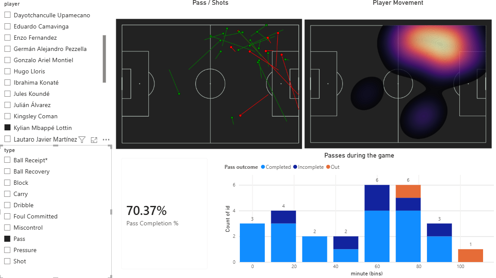
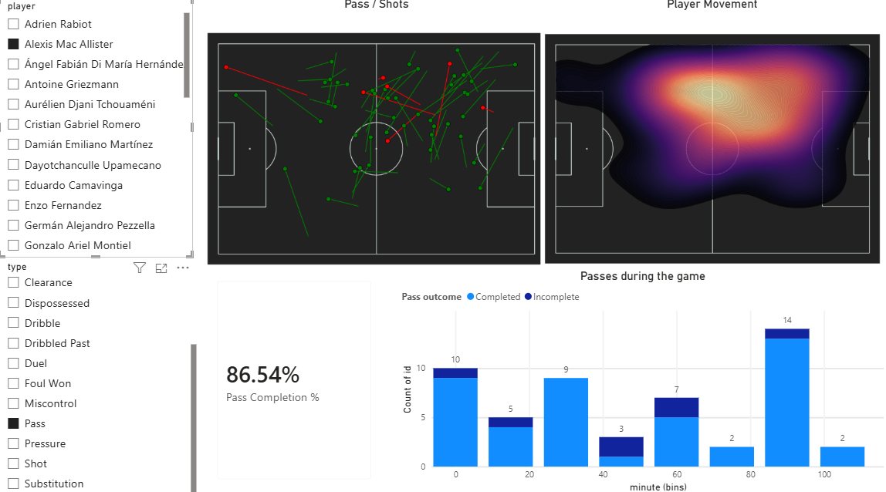

# Football Tactical Dashboard

A professional-grade football analytics dashboard that integrates Power BI's interactive cross-filtering with Python's advanced spatial mapping capabilities. This project transforms raw event data into broadcast-quality tactical visualizations, including pass networks, shot maps, density heatmaps, and match momentum charts.

---

##  Dynamic Tactical Views
The dashboard allows coaches and analysts to instantly filter tactical maps by individual players and event types.

**Forward Profile: Kylian Mbappé**

**Midfield Profile: Alexis Mac Allister**

---

## Tech Stack
* **Business Intelligence:** Power BI (Data Modeling, Slicers, Native Visuals)
* **Data Processing & Analytics:** Python, Pandas, DAX
* **Spatial Visualization:** matplotlib, mplsoccer, seaborn

---

##  Project Architecture & Phases

### Phase 1: Data Architecture & Modeling
To ensure the dashboard runs quickly and filters accurately, the underlying data model was streamlined.
* **Simplified Table Structure:** Removed redundant tables (like split start/end coordinate tables) in favor of a clean schema using just the core `Fact_Events` table and the `Dim_Players` table.
* **Data Cleaning Logic:** Accounted for professional football data standards where a successful action is often left blank. Built logic to recognize `BLANK()`, "nan", and "Completed" as successful outcomes so Python and Power BI calculate accuracy flawlessly.
* **1-to-Many Relationships:** Ensured the player dimension table correctly filters the event table, allowing the entire dashboard to instantly react when a specific player is selected.

### Phase 2: The Advanced Python Pitch Visual
Instead of relying on a static background image, the primary spatial visualization was built natively using a specialized sports analytics Python library.
* **Mathematical Pitch Generation (`mplsoccer`):** Deployed the `mplsoccer` library to draw a mathematically perfect pitch grid. This eliminates the "drifting dots" issue caused by misaligned background images.
* **Standardized Coordinate System:** Locked the visual to the industry-standard 'Statsbomb' 120x80 coordinate scale, ensuring every data point snaps exactly to the correct chalk lines (penalty boxes, midfield circle).
* **Broadcast-Quality Styling:** Configured a "Dark Mode" aesthetic using a dark charcoal background (`#222222`) with subtle silver lines (`#c7d5cc`). This reduces eye strain and makes the brightly colored data points pop.

### Phase 3: Spatial Event Mapping (Passes, Shots, and Density)
The Python visual was engineered to dynamically map three different types of spatial data simultaneously.
* **Pass Networks:** Plotted starting coordinates as distinct dots with lines connecting to the end coordinates. Applied conditional formatting: Clean Green (`#2ecc71`) for completed passes and Sharp Red (`#e74c3c`) for incomplete passes.
* **Shot Tracking (Universal Mapping):** Engineered the script to read both pass and shot columns in the same visual. Shots are automatically distinguished from passes by using a larger, distinct "Star" shape and thicker lines, colored by Goal (Green) or Miss/Save (Red).
* **Player Territory (KDE Heatmaps):** Implemented Kernel Density Estimation (`seaborn.kdeplot`) to generate a smooth, glowing heatmap overlaid on the pitch. Using the `magma` color scale, this visually highlights a player's primary zones of influence and spatial dominance.

### Phase 4: Native Power BI Analytics & Interactivity
To transform the visual from a static map into an interactive tactical tool, native Power BI DAX and charting tools were integrated alongside the Python script.
* **Headline KPI Card (Pass Completion %):** Authored a precise DAX formula to calculate true pass accuracy (Correct Passes / Total Passes), giving viewers an immediate summary metric.
* **Match Momentum Chart:** Grouped the raw minute data into 15-minute tactical "bins." Built a stacked bar chart across the bottom of the screen showing action volume and completion rates over time. This chart is strictly filtered to "Passes" to prevent other events (like ball receipts) from artificially inflating the numbers.
* **Cross-Filtering Interactivity:** Linked the Power BI slicers and native charts directly to the Python visual. Clicking a specific player's name, or a specific 15-minute bar on the momentum chart, automatically filters the coordinates sent to Python, redrawing the pitch instantly for that exact scenario.
